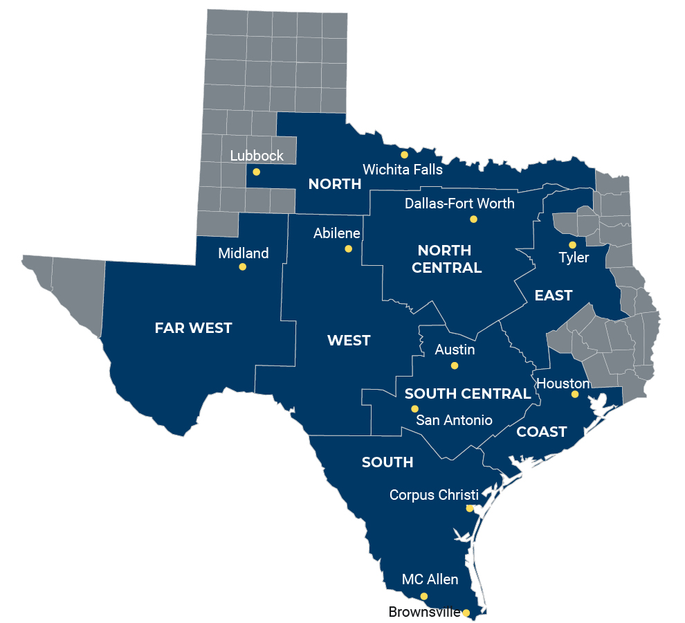
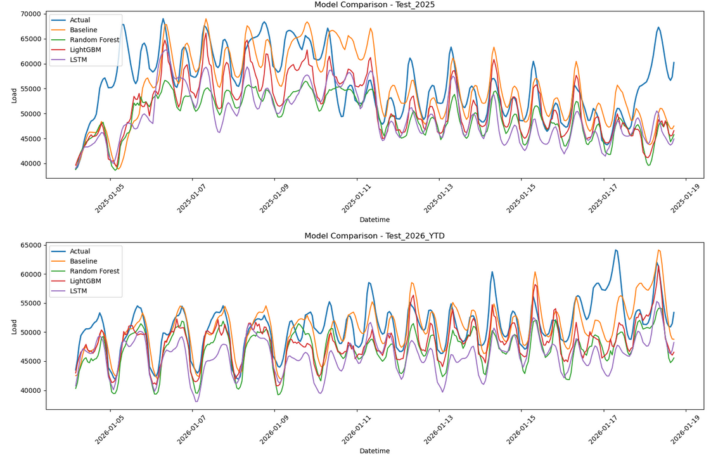

# ERCOT Load Forecasting with Weather and Time-Series Models

In this project, I built a 24-hour-ahead ERCOT load forecasting pipeline using hourly ERCOT native load data and hourly weather data from representative cities across ERCOT weather zones.

I compared four models on the same task:

- a naive persistence baseline
- Random Forest
- LightGBM
- LSTM

My main goal was to build a forecasting workflow that was realistic, well-evaluated, and easy to inspect, rather than just training one model and reporting a single metric.

## Problem Statement

I forecast ERCOT total load 24 hours ahead using:

- recent system load
- lagged load features
- calendar/time features
- weather features from representative ERCOT zones

Formally:

- `target_24h = ERCOT load at time t + 24 hours`


## Data Sources

### ERCOT load data

ERCOT native load data for:

- 2022
- 2023
- 2024
- 2025
- 2026 

<small>This data was accessed through: https://www.ercot.com/gridinfo/load/load_hist.</small>

The dataset includes zone-level load columns and total ERCOT load.



<small>Image Source: https://www.ercot.com/news/mediakit/maps</small>


### Weather data
I used hourly weather data from Open-Meteo for representative locations mapped to ERCOT weather zones.

| location_id | City Proxy        | Zone  |
|------------:|-------------------|-------|
| 0           | Houston           | COAST |
| 1           | Tyler             | EAST  |
| 2           | Midland           | FWEST |
| 3           | Dallas-Fort Worth | NCENT |
| 4           | Corpus Christi    | SOUTH |
| 5           | Austin            | SCENT |
| 6           | Abilene           | WEST  |
| 7           | Wichita Falls     | NORTH |

<small>This data was accessed through: https://open-meteo.com/en/docs/historical-weather-api.</small>


## Evaluation Setup

I used time-based splits:

- **Train:** 2022–2023
- **Validation:** 2024
- **Test:** 2025
- **Secondary robustness check:** 2026 *YTD*

I treated 2025 as the main test year as it is the most recent complete year. 2026 was used as a secondary robustness check due to it's incomplete nature.

## Main Results

### 2025 holdout year

| Model | MAE | RMSE | MAPE | R_squared |
|------|----:|-----:|-----:|----------:|
| LightGBM | 2621.898 | 3715.387 | 4.594% | 0.86800 |
| Baseline_CurrentERCOT | 3150.300 | 4254.870 | 5.639% | 0.82688 |
| Random Forest | 2998.473 | 4257.757 | 5.225% | 0.82664 |
| LSTM | 3117.018 | 4268.378 | 5.456% | 0.82572 |

### 2026 YTD robustness check

| Model | MAE | RMSE | MAPE | R_squared |
|------|----:|-----:|-----:|----------:|
| Baseline_CurrentERCOT | 2911.989 | 3997.250 | 5.444% | 0.62906 |
| LightGBM | 3053.558 | 4638.775 | 5.483% | 0.50044 |
| Random Forest | 3981.828 | 5484.103 | 7.177% | 0.30178 |
| LSTM | 3999.069 | 5563.192 | 7.129% | 0.28410 |




## Key Takeaways

- LightGBM performed best on the full 2025 holdout year
- The naive persistence baseline performed best on 2026 *YTD*
- A full holdout year and an incomplete recent window can produce very different conclusions
- The LSTM was competitive, but it did not beat LightGBM on the main holdout year

## Repo Structure

```
.
├── data/
│   ├── Native_Load_2022.xlsx
│   ├── Native_Load_2022.xlsx
│   ├── Native_Load_2023.xlsx
│   ├── Native_Load_2024.xlsx
│   ├── Native_Load_2025.xlsx
│   ├── Native_Load_2026.xlsx
│   ├── open-meteo.csv
│   └── open-meteo-locations.csv
├── output/
│   ├── model_search_results.csv
│   ├── model_final_results.csv
│   └── event_metrics_2025_01_17_to_2025_01_23.csv
├── docs/
│   ├── methodology.md
│   ├── results.md
│   └── event-analysis.md
└── ErcotLoadPredictor.ipynb
```

## How to Run

- Collect the data from the Open-Meteo and ERCOT websites.
- Seperate the Open-Meteo locations data from the weather data
- Place rename the ERCOT load files and Open-Meteo CSVs into ./data/ based on the repo structure above
- Run the `ErcotLoadPredictor.ipynb` from top to bottom
- Check generated outputs in `./output/`

## Summary

This project compares naive baseline, tree-based, boosting, and LTSM sequence models for 24-hour-ahead ERCOT load prediction using load, weather, and calendar features.

The main result was that LightGBM generalized the best on the full 2025 holdout year, while the naive baseline held up best on the incomplete robustness check.

## Additional Information

See [docs/methodology.md](docs/methodology.md) for feature engineering, split design, and model setup.

See [docs/results.md](docs/results.md) for a fuller discussion of model performance 

See [docs/event-analysis.md](docs/event-analysis.md) for the January 2025 event-window analysis

