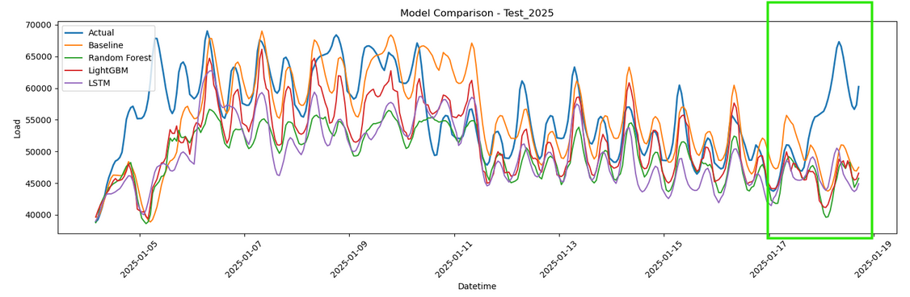
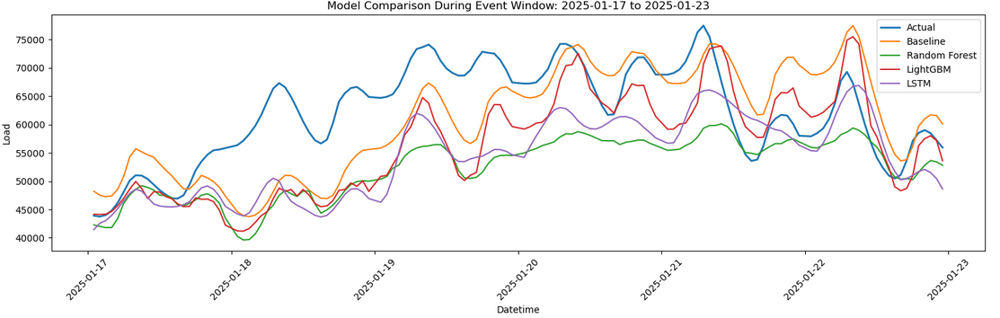

# Event Analysis: January 2025 Error Window

## Why I Looked at This Window

<small>Discrepancy highlighted in green box</small>

While reviewing the model predictions, I noticed a particularly large discrepancy around **2025-01-17 to 2025-01-23**.

Instead of only reporting average metrics, I wanted to look more closely at a period where the models struggled. To better understand not just when the models work, but also when they break down.

## What Happened

During this period, the predicted ERCOT load differed noticeably from the actual load.

Through some research, I found that this period lined up with an ERCOT Weather Watch and broader winter-weather preparation across Texas

This shows that a model can perform well on a yearly average and still miss the mark on short high-stress periods. 

## What I Included in the Notebook

In the notebook, I added:

- an event-window comparison plot
- an event-window metrics table
- a saved CSV in `output/event_metrics_2025_01_17_to_2025_01_23.csv`

This lets me compare how each model behaved during the same short period.

## My Interpretation

I would describe this window as a useful stress case rather than a failure of the project.

The main model results still matter, but this event analysis shows that:

- forecasting performance is not uniform across all periods
- extreme or unusual demand regimes deserve separate inspection
- the best annual model is not always the best event-window model

## Future Follow-Up

If I extended this project further, I would look at:

- holiday indicators
- explicit extreme-weather markers
- alert/watch windows
- multi-horizon forecasts during event periods

That would make the model more event-aware and help explain short-term forecasting misses more clearly.